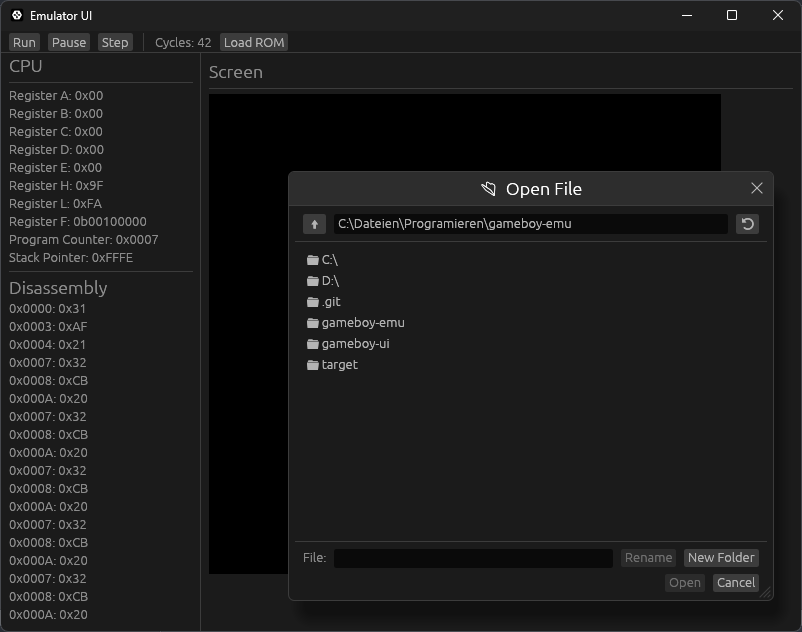

# DGBE - Draals's GameBoy Emulator
DGBE is a GameBoy emulator written in Rust. It was mainly written for fun, so expect bugs and inaccurate emulation.

## Quick Start
For now, the only way you can run this is by cloning the repo and building it yourself. You need a Rust toolchain (v1.95 - others may work too) and then you can build it with `cargo build --release` or directly run and build it with `cargo run --release`

## Features
- Emulation of (almost) all opcodes of the original GameBoy
- Emulation of Memory
- Emulation of Memory Bank Controllers (only MBC1)
- A nice UI, where you can go through your ROM and execute it instruction by instruction

## Tech
egui, egui_file and eframe for the UI and the open file dialog. The rest is good old Rust.

## AI
AI was used in this project, but all generated code has been double-checked by a human (me)
